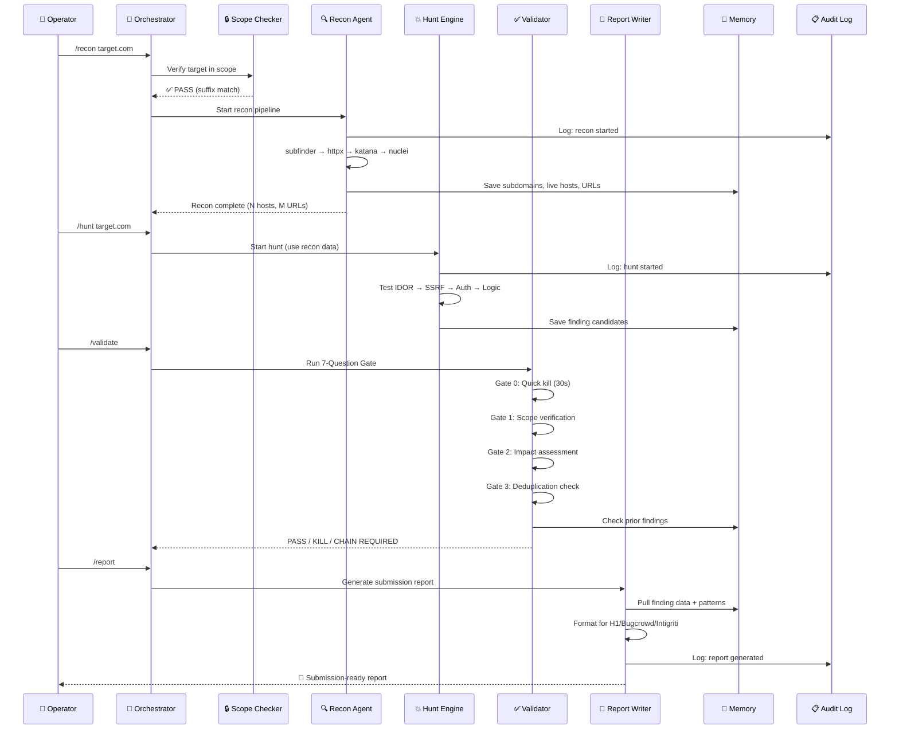
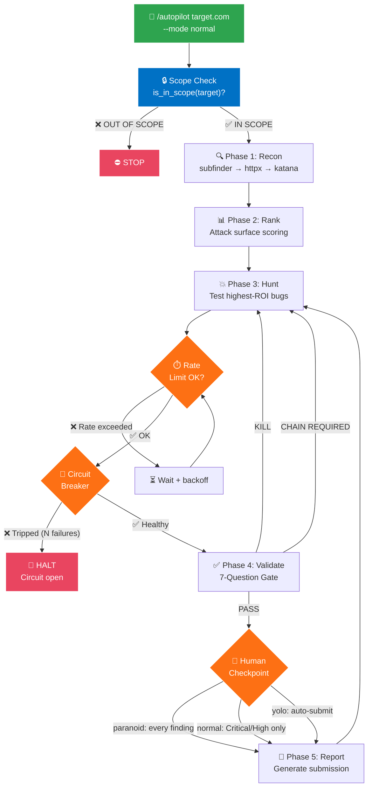
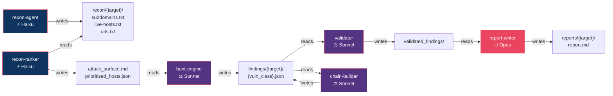
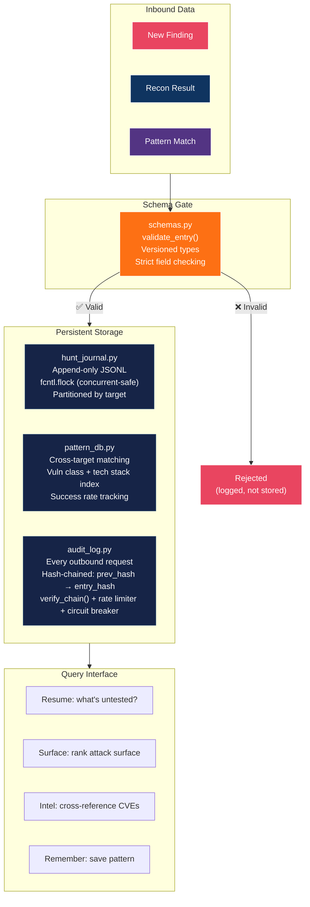
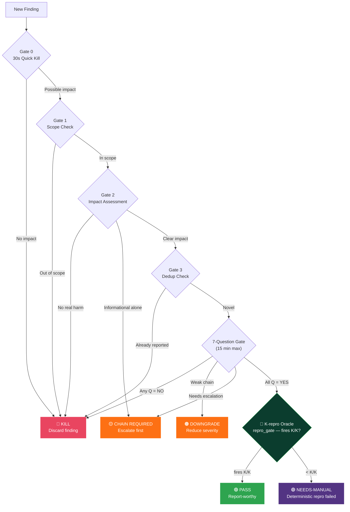

# System Architecture — Sentinel AI Offensive

<div align="center">

**v1.0.0** · Deep-Dive Technical Architecture & System Design

</div>

---

## Design Philosophy

Sentinel AI Offensive is built on four architectural principles:

| Principle | Rationale |
|:---|:---|
| **Agent Harness, Not Scripts** | AI orchestrates tools with reasoning — not blind automation |
| **Defense-in-Depth** | 8 layers of security controls, not a single gatekeeper |
| **Memory-First** | Every action persisted; patterns from target A inform target B |
| **Compliance by Construction** | Regulatory controls are code, not documentation afterthoughts |

---

## Layer Architecture

The platform is decomposed into 6 layers, each with clear responsibilities and interfaces:

```mermaid
graph TB
    subgraph L1["Layer 1 — User Interface"]
        TERMINAL["Terminal\nClaude Code CLI"]
        BURP["Burp Suite\nProxy"]
        SLASH["13 Slash Commands\n/recon · /hunt · /validate\n/report · /autopilot"]
    end

    subgraph L2["Layer 2 — Orchestration"]
        CLAUDE["Claude Code\nAI Orchestrator"]
        RULES["Always-Active Rules\nhunting.md · reporting.md"]
        SKILLS["11 Skill Domains\n9,352 lines of methodology"]
    end

    subgraph L3["Layer 3 — Agent"]
        SPEED["⚡ Speed Tier — Haiku\nrecon-agent · recon-ranker"]
        BALANCED["⚖️ Balanced Tier — Sonnet\nvalidator · chain-builder\nautopilot · web3-auditor"]
        QUALITY["💎 Quality Tier — Opus\nreport-writer"]
    end

    subgraph L4["Layer 4 — Tool"]
        RECON_T["Recon Tools\nsubfinder · httpx\nkatana · nuclei"]
        SAST_T["SAST Tools\nsemgrep · trufflehog\ngitleaks · sisakulint"]
        VULN_T["Vuln Scanners\nIDOR · OAuth · Race\nXSS · SQLi · SSRF"]
        NET_T["Network Tools\nnmap · masscan\nhydra · crackmapexec"]
    end

    subgraph L5["Layer 5 — Data"]
        JOURNAL["Hunt Journal\nAppend-only JSONL\nfcntl.flock"]
        PATTERN["Pattern DB\nCross-target learning\nVuln class matching"]
        AUDIT["Audit Log\nHash-chained (prev_hash/entry_hash)\nRate limiter + Circuit breaker"]
        SCHEMA["Schemas\nVersioned types\nStrict validation"]
        TRUST["Trust Layer (deterministic)\nattest.py scope attestation\noracle.py K-repro gate\nprior.py EV + negative memory"]
    end

    subgraph L6["Layer 6 — Integration"]
        BURP_MCP["Burp MCP\nProxy history\nCollaborator"]
        H1_MCP["HackerOne MCP\nHacktivity\nProgram policy"]
        NVD["External APIs\nNVD · GitHub Advisory"]
    end

    L1 --> L2
    L2 --> L3
    L3 --> L4
    L4 --> L5
    L4 --> L6
    L6 --> L5

    style TERMINAL fill:#1a1a2e,stroke:#e94560,color:#fff
    style BURP fill:#1a1a2e,stroke:#e94560,color:#fff
    style SLASH fill:#1a1a2e,stroke:#e94560,color:#fff
    style CLAUDE fill:#16213e,stroke:#0f3460,color:#fff
    style RULES fill:#16213e,stroke:#0f3460,color:#fff
    style SKILLS fill:#16213e,stroke:#0f3460,color:#fff
    style SPEED fill:#0f3460,stroke:#533483,color:#fff
    style BALANCED fill:#533483,stroke:#e94560,color:#fff
    style QUALITY fill:#e94560,stroke:#fff,color:#fff
    style RECON_T fill:#1a1a2e,stroke:#e94560,color:#fff
    style SAST_T fill:#1a1a2e,stroke:#e94560,color:#fff
    style VULN_T fill:#1a1a2e,stroke:#e94560,color:#fff
    style NET_T fill:#1a1a2e,stroke:#e94560,color:#fff
    style JOURNAL fill:#162447,stroke:#1f4068,color:#fff
    style PATTERN fill:#162447,stroke:#1f4068,color:#fff
    style AUDIT fill:#162447,stroke:#1f4068,color:#fff
    style SCHEMA fill:#162447,stroke:#1f4068,color:#fff
    style TRUST fill:#0b3d2e,stroke:#2ea44f,color:#fff
    style BURP_MCP fill:#1b1b2f,stroke:#e43f5a,color:#fff
    style H1_MCP fill:#1b1b2f,stroke:#e43f5a,color:#fff
    style NVD fill:#1b1b2f,stroke:#e43f5a,color:#fff
```



### Layer Responsibilities

| Layer | Responsibility | Key Constraint |
|:---|:---|:---|
| **L1 — User Interface** | Receive operator commands; display results | Never execute without scope verification |
| **L2 — Orchestration** | Route tasks to agents; enforce rules; select skills | Rules are always active — cannot be overridden |
| **L3 — Agent** | Execute specialized tasks with appropriate AI model tier | Each agent limited to its defined tool scope |
| **L4 — Tool** | Run security tools; collect raw output | All output flows through scope checker and audit log |
| **L5 — Data** | Persist findings, patterns, audit events; attest scope-clean; gate findings | Append-only; schema-validated; file-locked; audit log hash-chained (tamper-evident) |
| **L6 — Integration** | Connect to external services (Burp, HackerOne, NVD) | HTTPS only; rate-limited; timeout-guarded |

---

## Data Flow Architecture

### Pipeline Data Flow — Recon to Report



### Autopilot Decision Flow



---

## Agent Architecture

### Model Selection Strategy

Each agent is assigned a model tier based on the task's accuracy/speed tradeoff:

```
                        ┌──────────────────────────────────────────┐
                        │          Model Selection Matrix          │
                        ├──────────┬───────────┬──────────────────┤
                        │ Priority │   Model   │    Rationale     │
                        ├──────────┼───────────┼──────────────────┤
  Speed-critical ──────►│ ⚡ Speed │  Haiku    │ Recon = volume   │
                        │          │           │ Rank = scoring   │
                        ├──────────┼───────────┼──────────────────┤
  Accuracy-critical ──►│ ⚖️ Bal.  │  Sonnet   │ Validate = logic │
                        │          │           │ Chain = reasoning │
                        │          │           │ Auto = judgment  │
                        ├──────────┼───────────┼──────────────────┤
  Quality-critical ───►│ 💎 Qual. │  Opus     │ Report = prose   │
                        │          │           │ Persuasion       │
                        └──────────┴───────────┴──────────────────┘
```

### Agent Communication Pattern

Agents communicate exclusively through the file system (L5 Data Layer):



---

## Memory System Design

### Architecture



### Concurrency Safety

```python
# hunt_journal.py uses file-level locking for concurrent safety:
import fcntl

def append_entry(filepath, entry):
    with open(filepath, 'a') as f:
        fcntl.flock(f.fileno(), fcntl.LOCK_EX)   # Exclusive lock
        f.write(json.dumps(entry) + '\n')
        fcntl.flock(f.fileno(), fcntl.LOCK_UN)    # Release
```

### Schema Versioning

```
v1 → v2: Added 'tech_stack' field to hunt entries
v2 → v3: Added 'cvss_vector' to finding entries
v3 → v4: Added 'chain_id' for exploit chain grouping
```

All schemas are backward-compatible. Migration is handled by `schemas.py`:
- Unknown fields → preserved (forward compat)
- Missing fields → default values applied (backward compat)

### Trust Layer (Deterministic)

The trust layer keeps the model out of the "is this real / did I stay in scope" decision. Three
deterministic components sit on top of the memory system so provenance and repeatability are checkable
by code, not asserted by prose.

| Component | What it does | Contract |
|:---|:---|:---|
| **Tamper-evident audit log** (`memory/audit_log.py`) | Every entry carries a `prev_hash` and an `entry_hash` linking it to the one before it; `verify_chain()` recomputes the chain and fails on any edit, reorder, or deletion. `schemas.py` registers `prev_hash`/`entry_hash` as audit fields. | Chain verifies, or the log is rejected as tampered. |
| **Scope attestation** (`tools/attest.py`) | Verifies the audit log's hash chain, then proves the engagement stayed scope-clean. Exits `1` if any recorded request went out of scope. `python3 tools/attest.py <audit.jsonl>` | Exit 0 = intact chain + zero out-of-scope requests; exit 1 otherwise. |
| **K-repro Oracle** (`tools/oracle.py`) | `repro_gate` runs a deterministic predicate K times; a finding is marked REAL only if the predicate fires **K/K**. Anything short of that routes to a **needs-manual** lane. The model never mints a finding on its own. | REAL only on K/K, else needs-manual. |
| **Expected-value prior** (`memory/prior.py`) | A Beta prior over your own confirm/reject history plus a dead-end negative memory, wired into `pattern_db.match()` so past outcomes (including known dead ends) shift what gets prioritized. | Prioritization reflects observed hit rate, not raw enthusiasm. |

```
attest.py    →  verify_chain()  →  scope-clean proof   →  exit 0 / 1
oracle.py    →  repro_gate(K)   →  K/K ? REAL : needs-manual
prior.py     →  Beta(confirm, reject) + dead-ends  →  pattern_db.match()
```

---

## Security Architecture

### Defense-in-Depth Model

```
Request Flow:

  User Input                                                    Target
     │                                                            │
     ▼                                                            │
  ┌──────────────┐                                                │
  │ L7: Elicit.  │◄── Human must approve destructive actions      │
  │    Checkpoint │                                                │
  └──────┬───────┘                                                │
         ▼                                                        │
  ┌──────────────┐                                                │
  │ L6: 4-Gate   │◄── Finding must pass 7 questions               │
  │    Validate  │                                                │
  └──────┬───────┘                                                │
         ▼                                                        │
  ┌──────────────┐                                                │
  │ L5: Safe     │◄── PUT/DELETE/PATCH blocked in auto mode       │
  │    Method    │                                                │
  └──────┬───────┘                                                │
         ▼                                                        │
  ┌──────────────┐                                                │
  │ L4: Circuit  │◄── Stop after N consecutive failures           │
  │    Breaker   │                                                │
  └──────┬───────┘                                                │
         ▼                                                        │
  ┌──────────────┐                                                │
  │ L3: Rate     │◄── Per-host request throttling                 │
  │    Limiter   │                                                │
  └──────┬───────┘                                                │
         ▼                                                        │
  ┌──────────────┐                                                │
  │ L2: Scope    │◄── Deterministic suffix-anchored matching      │
  │    Checker   │                                                │
  └──────┬───────┘                                                │
         ▼                                                        │
  ┌──────────────┐                                                │
  │ L1: Audit    │◄── Hash-chained JSONL — verify_chain()         │
  │    Log       │    attest.py proves scope-clean (exit 1 = fail)│
  └──────┬───────┘                                                │
         ▼                                                        │
  ┌──────────────┐                                                │
  │ L0: Schema   │◄── Typed, versioned data contracts             │
  │    Validate  │                                                │
  └──────┬───────┘                                                │
         ▼                                                        │
     Outbound ──────────────────────────────────────────────► Target
     Request                                                  System
```

---

## Scalability & Extension

### Adding a New Skill

```
1. Create directory:     skills/your-skill-name/
2. Add SKILL.md:         YAML frontmatter (name, description) + methodology
3. Update install.sh:    (automatic — copies all skills/*/)
4. Update CLAUDE.md:     Add to skill table
5. Update README.md:     Add to skill domains section
```

### Adding a New Agent

```
1. Create agent file:    agents/your-agent.md
2. Define:               Model tier, allowed tools, task scope, output format
3. Reference from:       Relevant commands or autopilot
```

### Adding a New Command

```
1. Create command file:  commands/your-command.md
2. Define:               Arguments, agent routing, output format
3. Update CLAUDE.md:     Add to commands table
```

### Adding a New Tool

```
1. Create tool file:     tools/your_tool.py (or .sh)
2. Integrate:            Scope checker + audit log + schema validation
3. Add tests:            tests/test_your_tool.py
4. Update install:       install_tools.sh (if external dependency needed)
```

---

## Decision Architecture

### Gate-Based Decision Trees



The 7-Question Gate is human/model judgment; the **K-repro Oracle** (`tools/oracle.py`) is the
deterministic backstop after it. A finding is only marked **PASS/REAL** when `repro_gate` fires its
predicate **K/K** — anything short routes to a **needs-manual** lane, so the model never mints a
finding on its own. Prioritization of what to test first is shaped by the expected-value prior in
`memory/prior.py` (Beta over past confirm/reject outcomes + dead-end negative memory), wired into
`pattern_db.match()`.

---

## File System Layout

```
sentinel-ai-offensive/
├── ARCHITECTURE.md          ← You are here
├── SECURITY.md              ← Security policy & threat model
├── COMPLIANCE.md            ← Regulatory control mapping
├── README.md                ← Project overview & quick start
├── CLAUDE.md                ← Claude Code plugin guide
├── CHANGELOG.md             ← Version history
├── CONTRIBUTING.md          ← Contribution guidelines
├── CODE_OF_CONDUCT.md       ← Community standards
├── LICENSE                  ← MIT License
│
├── skills/                  ← 11 skill domains (SKILL.md files)
│   ├── sentinel-core/       ← Master workflow (1,547 lines)
│   ├── hunt-mindset/        ← Hunting methodology (352 lines)
│   ├── apex-pipeline/       ← AppSec pipeline (562 lines)
│   ├── code-reaper/         ← Deep SAST (759 lines)
│   ├── netbreach/           ← Network pentesting (1,206 lines)
│   ├── ghost-recon/         ← Recon pipeline (425 lines)
│   ├── vuln-matrix/         ← 20 vuln classes (832 lines)
│   ├── payload-forge/       ← Payloads & bypasses (838 lines)
│   ├── chain-guard/         ← Smart contracts (550 lines)
│   ├── strike-report/       ← Report templates (482 lines)
│   └── verdict-gate/        ← Validation gates (252 lines)
│
├── commands/                ← 13 slash commands
├── agents/                  ← 7 specialized AI agents
├── tools/                   ← Python/shell tools (incl. attest.py, oracle.py)
├── memory/                  ← Hunt memory + trust layer (hash-chained audit, prior.py)
├── mcp/                     ← MCP integrations (Burp + HackerOne)
├── tests/                   ← Test suite
├── rules/                   ← Always-active rules
├── hooks/                   ← Session lifecycle hooks
├── docs/                    ← Technique guides
├── web3/                    ← Smart contract audit chain
├── scripts/                 ← Shell wrappers
└── wordlists/               ← 5 wordlists (vendored)
```

---

<div align="center">

**Architecture designed for offensive security professionals who ship bugs, not noise.**

</div>
