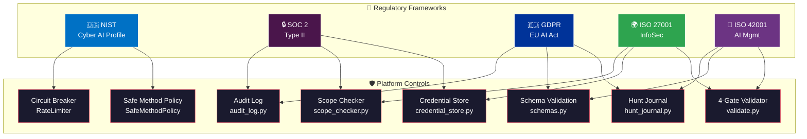

# Compliance & Regulatory Alignment

<div align="center">

**Sentinel AI Offensive v1.0.0** · Compliance Control Mapping

[](#nist-cybersecurity--ai-profile)
[](#soc-2-type-ii-trust-service-criteria)
[](#gdpr--eu-ai-act)
[](#iso-27001--information-security)
[](#iso-42001--ai-management-system)

</div>

---

## Overview

This document maps Sentinel AI Offensive's security controls to five regulatory frameworks. Each control is linked to its implementing code, enabling auditors and reviewers to verify claims against actual implementation.



---

## NIST Cybersecurity & AI Profile

> Reference: [NIST AI Risk Management Framework (AI RMF 1.0)](https://www.nist.gov/artificial-intelligence/ai-risk-management-framework) and [Cybersecurity Framework 2.0](https://www.nist.gov/cyberframework)

| NIST Control | Requirement | Implementation | Evidence |
|:---|:---|:---|:---|
| **GV.AI-01** | AI agents as discrete identities with scoped access | 7 agents with defined roles, model assignments, and tool access scopes | `agents/*.md` — each agent specifies allowed tools and model |
| **GV.AI-02** | Kill-switch / graceful degradation for AI systems | `/autopilot` circuit breaker stops after N consecutive failures; 3 checkpoint modes (paranoid/normal/yolo) | `memory/audit_log.py` → `CircuitBreaker` class |
| **GV.AI-03** | Human-in-the-loop oversight for high-risk actions | Elicitation checkpoints require human approval before destructive operations | `commands/autopilot.md` → checkpoint modes |
| **ID.AM-01** | Asset inventory maintained | Target scope explicitly defined before any testing begins | `tools/scope_checker.py` |
| **PR.AC-01** | Least privilege access enforcement | Agents can only access tools within their defined scope; safe method policy blocks destructive HTTP methods | `memory/audit_log.py` → `SafeMethodPolicy` |
| **PR.DS-01** | Data-at-rest protection | Sensitive output directories in `.gitignore`; credential store masks all secrets | `.gitignore`, `tools/credential_store.py` |
| **PR.DS-02** | Data-in-transit protection | All outbound requests via HTTPS; MCP integrations use TLS | `mcp/hackerone-mcp/server.py` → SSL context |
| **DE.AE-01** | Anomaly detection in AI operations | Circuit breaker detects failure patterns (consecutive 403/429/timeout) | `memory/audit_log.py` → `CircuitBreaker.record_failure()` |
| **DE.CM-01** | Continuous monitoring of operations | Immutable JSONL audit log records every outbound request with timestamp + agent identity | `memory/audit_log.py` → `AuditLogger` |
| **RS.RP-01** | Incident response plan documented | Security policy with severity classification and response timelines | `SECURITY.md` |

---

## SOC 2 Type II Trust Service Criteria

> Reference: [AICPA Trust Services Criteria (2017)](https://us.aicpa.org/interestareas/frc/assuranceadvisoryservices/trustdataintegritytaskforce)

| TSC | Criterion | Implementation | Evidence |
|:---|:---|:---|:---|
| **CC1.1** | Integrity and ethical values | Responsible disclosure policy; ethical testing mandate; scope verification before all testing | `SECURITY.md`, `rules/hunting.md` Rule #1 |
| **CC2.1** | Information quality — complete and accurate data | Schema validation for all hunt entries with versioned schemas | `memory/schemas.py` → `validate_entry()` |
| **CC3.1** | Risk assessment process | Threat model documented with 8 attack vectors and mitigations | `SECURITY.md` → Threat Model |
| **CC5.1** | Control activities — authorization and approval | 4-gate validation before any report submission; elicitation checkpoints for destructive actions | `tools/validate.py`, `commands/autopilot.md` |
| **CC6.1** | Logical access controls | Scope checker enforces deterministic domain matching; credential store for auth | `tools/scope_checker.py`, `tools/credential_store.py` |
| **CC6.2** | System access restrictions | Agent-level access control — each agent limited to specific tools and models | `agents/*.md` → tool_access definitions |
| **CC6.3** | System access removal | Session hooks clear state; no persistent auth tokens in memory | `hooks/hooks.json` |
| **CC7.1** | System monitoring | Audit log records every request; rate limiter tracks per-host request counts | `memory/audit_log.py` |
| **CC7.2** | Anomaly and incident detection | Circuit breaker pattern detects repeated failures and triggers automatic stop | `memory/audit_log.py` → `CircuitBreaker` |
| **CC8.1** | Change management | Changelog maintained; semantic versioning; git-based history | `CHANGELOG.md` |
| **A1.1** | Availability — recovery from disruptions | `/resume` command recovers previous hunt state; hunt journal persists across sessions | `commands/resume.md`, `memory/hunt_journal.py` |

---

## GDPR & EU AI Act

> Reference: [General Data Protection Regulation (EU 2016/679)](https://gdpr-info.eu/) and [EU AI Act (2024/1689)](https://artificialintelligenceact.eu/)

| Article | Requirement | Implementation | Evidence |
|:---|:---|:---|:---|
| **Art. 5(1)(c)** | Data minimization | Hunt memory stores only technical data (endpoints, vuln class, PoC commands); no PII (names, emails, personal data) stored | `memory/schemas.py` → schema fields |
| **Art. 5(1)(e)** | Storage limitation | Findings stored per-target in isolated directories; no cross-target PII correlation | Directory structure: `findings/{target}/` |
| **Art. 12** | Transparent and traceable processing | Immutable JSONL audit log with timestamps, agent identity, target, and action type | `memory/audit_log.py` → `AuditLogger.log()` |
| **Art. 17** | Right to erasure (RTBF) | No PII stored in hunt memory; all data is technical endpoint/vulnerability data; target directories can be deleted cleanly | `memory/` module stores no personal data |
| **Art. 25** | Data protection by design | Credential store masks all secrets; `.gitignore` excludes sensitive output; schema validation prevents unstructured data | `tools/credential_store.py`, `.gitignore` |
| **Art. 30** | Records of processing activities | Hunt journal maintains append-only processing log | `memory/hunt_journal.py` |
| **Art. 32** | Security of processing | Defense-in-depth stack: scope check → rate limit → circuit breaker → validation → audit log | See Runtime Security Controls in `SECURITY.md` |
| **EU AI Act Art. 9** | Risk management system for AI | Threat model with 8 attack vectors; circuit breaker for autonomous mode; human oversight via checkpoints | `SECURITY.md`, `memory/audit_log.py` |
| **EU AI Act Art. 13** | Transparency — AI system documentation | All agent behaviors documented; skill files contain full decision trees; audit log traces all AI actions | `agents/*.md`, `skills/*/SKILL.md` |
| **EU AI Act Art. 14** | Human oversight measures | 3 checkpoint modes (paranoid/normal/yolo); elicitation pauses before destructive actions; `/validate` gate before report | `commands/autopilot.md`, `tools/validate.py` |

---

## ISO 27001 — Information Security

> Reference: [ISO/IEC 27001:2022](https://www.iso.org/standard/27001) Annex A Controls

| Control | Title | Implementation | Status |
|:---|:---|:---|:---|
| **A.5.1** | Policies for information security | Security policy documented with threat model, SDL, incident response | ✅ `SECURITY.md` |
| **A.5.10** | Acceptable use of information assets | Scope checker enforces authorized testing only; rules mandate scope verification | ✅ `tools/scope_checker.py`, `rules/hunting.md` |
| **A.5.23** | Information security for cloud services | Cloud metadata access patterns documented; SSRF testing methodology includes cloud-aware checks | ✅ `skills/sentinel-core/SKILL.md` |
| **A.6.1** | Screening | Not applicable (open-source project) | N/A |
| **A.7.7** | Clear desk / clear screen | `.gitignore` excludes findings, recon data, reports from repository | ✅ `.gitignore` |
| **A.8.2** | Privileged access rights | Agent-level tool access scoping; safe method policy for autopilot | ✅ `agents/*.md`, `memory/audit_log.py` |
| **A.8.5** | Secure authentication | Credential store with masked output; no hardcoded secrets; environment variables only | ✅ `tools/credential_store.py` |
| **A.8.9** | Configuration management | Example config provided; actual config excluded from git; schema-validated settings | ✅ `config.example.json`, `.gitignore` |
| **A.8.12** | Data leakage prevention | Credential store masks secrets in `repr()`/`str()`; no PII in hunt memory; audit log is append-only | ✅ `tools/credential_store.py` |
| **A.8.15** | Logging | Immutable JSONL audit log with timestamp, agent ID, target, action | ✅ `memory/audit_log.py` |
| **A.8.16** | Monitoring activities | Per-host rate limiter; circuit breaker with configurable thresholds | ✅ `memory/audit_log.py` |
| **A.8.24** | Use of cryptography | All outbound requests via HTTPS/TLS; SSL context with certificate verification | ✅ `mcp/hackerone-mcp/server.py` |
| **A.8.25** | Secure development lifecycle | Security review checklist; code contribution requirements; dependency pinning | ✅ `SECURITY.md` → SDL |
| **A.8.28** | Secure coding | Input validation via schemas; no `eval()`/`exec()` on untrusted input; parameterized queries | ✅ `memory/schemas.py`, code review |
| **A.8.31** | Separation of environments | Findings, recon, reports in separate directories excluded from source control | ✅ `.gitignore` |

---

## ISO 42001 — AI Management System

> Reference: [ISO/IEC 42001:2023](https://www.iso.org/standard/81230.html) — Requirements for AI Management Systems

| Clause | Requirement | Implementation | Status |
|:---|:---|:---|:---|
| **5.2** | AI policy | AI agent behaviors documented; ethical use policy in README and rules | ✅ `rules/hunting.md`, `README.md` |
| **6.1.2** | AI risk assessment | Threat model with 8 attack vectors; CVSS-based severity classification | ✅ `SECURITY.md` |
| **6.1.4** | AI risk treatment plan | Each attack vector has documented mitigation with implementing code | ✅ `SECURITY.md` → AV-1 through AV-8 |
| **7.4** | Communication about AI system | All agent capabilities, limitations, and tool access documented | ✅ `agents/*.md`, `CLAUDE.md` |
| **8.2** | AI impact assessment | 7-Question Gate validates real-world impact before any report | ✅ `tools/validate.py`, `skills/verdict-gate/SKILL.md` |
| **8.4** | AI system lifecycle management | Full lifecycle logging: recon → hunt → validate → report with audit trail | ✅ `memory/hunt_journal.py`, `memory/audit_log.py` |
| **9.1** | Monitoring and measurement | Audit log, rate limiter, circuit breaker provide continuous monitoring | ✅ `memory/audit_log.py` |
| **9.2** | Internal audit | Schema validation ensures data integrity; 4-gate validation for outputs | ✅ `memory/schemas.py`, `tools/validate.py` |
| **10.1** | Continual improvement | Pattern database learns across targets; hunt journal accumulates methodology improvements | ✅ `memory/pattern_db.py` |
| **A.3.2** | Validate AI outputs before backend mutations | 4-gate validation before any report submission; 7-Question Gate eliminates false positives | ✅ `tools/validate.py` |
| **A.4.3** | Data quality for AI | Schema validation with typed fields and versioning; reject malformed entries | ✅ `memory/schemas.py` |
| **A.7.2** | AI system transparency | Skill files contain full decision trees; all 13 commands documented with expected behavior | ✅ `skills/*/SKILL.md`, `commands/*.md` |

---

## Zero-Trust Architecture

| Principle | Implementation | Enforcement Point |
|:---|:---|:---|
| **Never trust, always verify** | Every target domain verified against scope before any request | `tools/scope_checker.py` → `is_in_scope()` |
| **Least privilege** | Each agent has minimum required tool access and model tier | `agents/*.md` → tool access definitions |
| **Assume breach** | Circuit breaker assumes network is hostile; stops on repeated failures | `memory/audit_log.py` → `CircuitBreaker` |
| **Verify explicitly** | 4-gate validation verifies every finding before report | `tools/validate.py` → 4 sequential gates |
| **Limit blast radius** | Per-host rate limiting prevents single target abuse; safe method policy blocks destructive operations | `memory/audit_log.py` → `RateLimiter`, `SafeMethodPolicy` |
| **Log everything** | Immutable audit log captures every outbound request and agent action | `memory/audit_log.py` → `AuditLogger` |
| **Pinned dependencies** | No floating versions; `--ignore-scripts` for npm; Go binaries from source | `install.sh`, `install_tools.sh` |

---

## Evidence & Audit Trail

### How to Verify Controls

```bash
# 1. Verify scope checker is deterministic
python3 -c "
from tools.scope_checker import ScopeChecker
sc = ScopeChecker(['*.example.com', 'api.target.com'])
assert sc.is_in_scope('sub.example.com') == True
assert sc.is_in_scope('evil.com') == False
print('✅ Scope checker verified')
"

# 2. Verify audit log is append-only
python3 -c "
from memory.audit_log import AuditLogger
logger = AuditLogger('/tmp/test_audit.jsonl')
logger.log('test_agent', 'example.com', 'GET', '/api/test')
print('✅ Audit logger verified')
"

# 3. Verify schema validation rejects bad data
python3 -c "
from memory.schemas import validate_entry
try:
    validate_entry({'type': 'invalid'})
    print('❌ Should have rejected')
except Exception:
    print('✅ Schema validation verified')
"

# 4. Verify credential store masks secrets
python3 -c "
from tools.credential_store import CredentialStore
cs = CredentialStore()
cs.set('test_key', 'super_secret_value')
assert 'super_secret' not in str(cs)
assert 'super_secret' not in repr(cs)
print('✅ Credential store masking verified')
"

# 5. Run full test suite
python3 -m pytest tests/ -v
```

### Compliance Audit Checklist

```
[ ] All outbound requests flow through scope_checker.py
[ ] All outbound requests logged via audit_log.py
[ ] All findings validated via validate.py (4-gate)
[ ] All data entries validated via schemas.py
[ ] No hardcoded secrets in source (run: trufflehog, gitleaks)
[ ] .gitignore excludes all sensitive directories
[ ] Credential store masks all secret values
[ ] Circuit breaker active in autopilot mode
[ ] Safe method policy blocks destructive methods
[ ] Hunt journal maintains append-only log
[ ] Agent access scopes documented and enforced
[ ] Elicitation checkpoints enabled for all destructive operations
```

---

<div align="center">

**Compliance is built into the architecture, not bolted on after the fact.**

For compliance questions, contact [@mlvpatel](https://github.com/mlvpatel).

</div>
