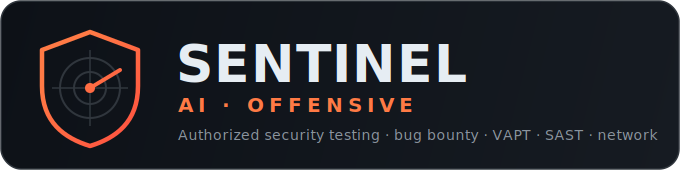

<p align="center">
  
</p>

<div align="center">

# Sentinel AI Offensive

**A Claude Code plugin for authorized offensive security** — bug bounty, VAPT, SAST, and network pentesting across HackerOne, Bugcrowd, Intigriti, and Immunefi.

[](LICENSE)
[](https://python.org)
[](tests/)
[](https://github.com/mlvpatel/sentinel-ai-offensive/actions/workflows/ci.yml)
[](https://claude.ai/claude-code)

[Install](#install) · [What's inside](#whats-inside) · [Trust layer](#the-trust-layer) · [Architecture](ARCHITECTURE.md) · [Safety](#safety--authorized-use)

</div>

---

## What it is

Sentinel is a **Claude Code plugin**: a set of skills, slash commands, and agents that guide a hunt from recon to a submission-ready report, backed by a small, well-tested Python library for the parts that must be deterministic — scope safety, hunt memory, and finding validation.

It is **not** an autonomous scanner and it does not fabricate findings. Claude proposes the next step; the deterministic layer keeps every request in scope, records it, and only lets a finding through when it can be reproduced. You stay in the loop.

> ⚠️ **Authorized use only.** Every workflow assumes you have explicit permission for the target — a bug-bounty program's scope, a signed pentest engagement, or your own systems. See [Safety](#safety--authorized-use).

## Install

```bash
# in Claude Code (two separate prompts)
/plugin marketplace add mlvpatel/sentinel-ai-offensive
/plugin install sentinel-ai-offensive@sentinel-ai-offensive
```

Then, from a repo you're authorized to test:

```
/recon target.com      # recon pipeline
/hunt target.com       # start hunting
/validate              # run the 7-Question Gate on a finding
/report                # write a submission-ready report
```

## What's inside

| Component | Count | Examples |
|---|--:|---|
| **Skills** | 11 | `sentinel-core`, `code-reaper` (SAST), `netbreach`, `vuln-matrix` (20 web2 classes), `chain-guard` (10 web3 classes), `strike-report`, `verdict-gate` |
| **Slash commands** | 13 | `/recon` `/hunt` `/validate` `/report` `/chain` `/scope` `/autopilot` `/web3-audit` |
| **Agents** | 7 | recon, validator, report-writer, chain-builder, autopilot, recon-ranker, web3-auditor |
| **Always-active rules** | 2 | `rules/hunting.md` (20 rules), `rules/reporting.md` |
| **MCP integrations** | 2 | Burp Suite proxy, HackerOne public API |

The **tested Python library** (238 tests, CI green) is what makes it trustworthy:
`memory/` (append-only hunt journal, cross-target pattern DB, expected-value prior, tamper-evident audit log, strict schemas), `tools/scope_checker.py` (deterministic scope safety), `tools/oracle.py` (reproducibility gate), and `tools/attest.py` (scope-clean proof).

## The trust layer

What separates Sentinel from "an AI that runs scanners": the parts that must be deterministic *are* deterministic.

- **Scope-attested audit trail** — every request is hash-chained in the audit log. `python3 tools/attest.py <audit.jsonl>` proves the chain is untampered and that **no request went out of scope**, exiting non-zero if it did. A finding can ship with cryptographic proof it stayed in bounds.
- **Deterministic reproducibility gate** — `tools/oracle.py` runs a finding's check *K times*; it's **REAL only on K/K**, else it's routed to a needs-manual lane. The model never declares a bug real on its own.
- **Expected-value memory** — `memory/prior.py` learns from your own confirmed/rejected history (a Beta prior per vuln class) and hard-kills classes your history says are dead ends, so the next hunt starts with the highest-value techniques.

## Architecture

Five layers: skills/commands (Claude Code) → 7 agents → invoked security tools → the deterministic Python library → local hunt memory. Full detail in [ARCHITECTURE.md](ARCHITECTURE.md).

```
skills/ commands/ agents/ rules/ hooks/     # the Claude Code plugin surface
tools/                                        # scope_checker, oracle, attest, recon, validate, report…
memory/                                       # hunt_journal · pattern_db · prior · audit_log · schemas (tested)
mcp/                                          # burp · hackerone
web3/  wordlists/  docs/                       # smart-contract content, lists, docs
```

## Safety & authorized use

- **Scope first, always.** `tools/scope_checker.py` gates targets deterministically; the audit log + `attest.py` prove compliance after the fact.
- **No out-of-scope requests, no destructive-by-default actions.** Autopilot has rate limiting, circuit breakers, and safe-method policy.
- **Compliance mapping, not certification.** [COMPLIANCE.md](COMPLIANCE.md) maps controls to NIST CSF / GDPR / ISO 27001 concepts to help you run engagements responsibly — it is a control-mapping aid, not a claim of certified compliance.
- See [SECURITY.md](SECURITY.md) for the threat model and reporting.

## Contributing & license

Contributions welcome — see [CONTRIBUTING.md](CONTRIBUTING.md) (branch naming, commit conventions, and the security checklist). MIT licensed ([LICENSE](LICENSE)). By contributing you agree your work is for **authorized security testing only**.

<div align="center">
<sub>Built by <a href="https://github.com/mlvpatel">Malav Patel</a> · offensive security, done in bounds.</sub>
</div>
