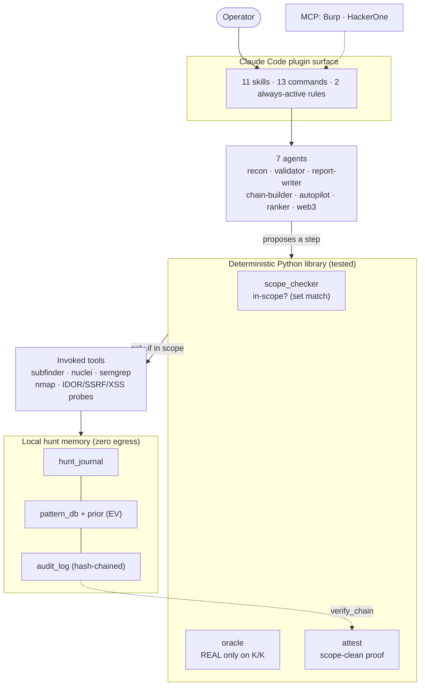

<p align="center">
  
</p>

<div align="center">

# Sentinel AI Offensive

**A Claude Code plugin for authorized offensive security** — bug bounty, VAPT, SAST, and network pentesting across HackerOne, Bugcrowd, Intigriti, and Immunefi.

[](LICENSE)
[](https://python.org)
[](tests/)
[](https://github.com/mlvpatel/sentinel-ai-offensive/actions/workflows/ci.yml)
[](https://claude.ai/claude-code)

[Install](#install) · [What's inside](#whats-inside) · [Trust layer](#the-trust-layer) · [Architecture](ARCHITECTURE.md) · [Safety](#safety--authorized-use)

</div>

---

## What it is

Sentinel is a **Claude Code plugin**: a set of skills, slash commands, and agents that guide a hunt from recon to a submission-ready report, backed by a small, well-tested Python library for the parts that must be deterministic — scope safety, hunt memory, and finding validation.

It is **not** an autonomous scanner and it does not fabricate findings. Claude proposes the next step; the deterministic layer keeps every request in scope, records it, and only lets a finding through when it can be reproduced. You stay in the loop.

> ⚠️ **Authorized use only.** Every workflow assumes you have explicit permission for the target — a bug-bounty program's scope, a signed pentest engagement, or your own systems. See [Safety](#safety--authorized-use).

## Install

```bash
# in Claude Code (two separate prompts)
/plugin marketplace add mlvpatel/sentinel-ai-offensive
/plugin install sentinel-ai-offensive@sentinel-ai-offensive
```

Then, from a repo you're authorized to test:

```
/recon target.com      # recon pipeline
/hunt target.com       # start hunting
/validate              # run the 7-Question Gate on a finding
/report                # write a submission-ready report
```

## What's inside

| Component | Count | Examples |
|---|--:|---|
| **Skills** | 11 | `sentinel-core`, `code-reaper` (SAST), `netbreach`, `vuln-matrix` (20 web2 classes), `chain-guard` (10 web3 classes), `strike-report`, `verdict-gate` |
| **Slash commands** | 13 | `/recon` `/hunt` `/validate` `/report` `/chain` `/scope` `/autopilot` `/web3-audit` |
| **Agents** | 7 | recon, validator, report-writer, chain-builder, autopilot, recon-ranker, web3-auditor |
| **Always-active rules** | 2 | `rules/hunting.md` (20 rules), `rules/reporting.md` |
| **MCP integrations** | 2 | Burp Suite proxy, HackerOne public API |

The **tested Python library** (238 tests, CI green) is what makes it trustworthy:
`memory/` (append-only hunt journal, cross-target pattern DB, expected-value prior, tamper-evident audit log, strict schemas), `tools/scope_checker.py` (deterministic scope safety), `tools/oracle.py` (reproducibility gate), and `tools/attest.py` (scope-clean proof).

## The trust layer

What separates Sentinel from "an AI that runs scanners": the parts that must be deterministic *are* deterministic.

- **Scope-attested audit trail** — every request is hash-chained in the audit log. `python3 tools/attest.py <audit.jsonl>` proves the chain is untampered and that **no request went out of scope**, exiting non-zero if it did. A finding can ship with cryptographic proof it stayed in bounds.
- **Deterministic reproducibility gate** — `tools/oracle.py` runs a finding's check *K times*; it's **REAL only on K/K**, else it's routed to a needs-manual lane. The model never declares a bug real on its own.
- **Expected-value memory** — `memory/prior.py` learns from your own confirmed/rejected history (a Beta prior per vuln class) and hard-kills classes your history says are dead ends, so the next hunt starts with the highest-value techniques.

## Architecture

Five layers, with a hard rule: **the reasoning (Claude) proposes, but the deterministic Python library disposes.** Scope safety, the audit trail, and finding validation are code — not a model's judgment. Full detail in [ARCHITECTURE.md](ARCHITECTURE.md).



```
skills/ commands/ agents/ rules/ hooks/     # the Claude Code plugin surface
tools/                                        # scope_checker, oracle, attest, recon, validate, report…
memory/                                       # hunt_journal · pattern_db · prior · audit_log · schemas (tested)
mcp/                                          # burp · hackerone
web3/  wordlists/  docs/                       # smart-contract content, lists, docs
```

## The math behind the trust layer

The trust layer is small on purpose, and every part reduces to a formula you can check — not a model's opinion.

**1 · Expected-value prioritization (Beta–Bernoulli).**
Each vuln class $C$ has a history of $s$ confirmed and $f$ rejected findings. With a uniform $\mathrm{Beta}(1,1)$ prior, the posterior mean probability of a confirm is

$$\hat{p}(C) = \frac{s+1}{s+f+2}, \qquad \mathrm{EV}(C) = \hat{p}(C)\times \mathrm{median\_payout}(C).$$

Patterns are ranked by $\mathrm{EV}$ (highest first), and a class is a **dead end** — hard-dropped — when $s=0$ and $f\ge 3$ (never paid, rejected enough to be confident). This is [`memory/prior.py`](memory/prior.py), wired into `pattern_db.match()`.

**2 · Deterministic reproducibility (the K-repro Oracle).**
A finding is **REAL only if its deterministic predicate fires on all $K$ independent replays** (default $K=3$). If a check is genuinely flaky and fires with per-trial probability $q$, the chance it *falsely* passes is

$$P(\text{false REAL}) = q^{K}.$$

The gate also demands determinism: a result of $1/3$ or $2/3$ is **FLAKY → needs-manual**, never auto-submitted. The model never adjudicates a bug. This is [`tools/oracle.py`](tools/oracle.py).

**3 · Tamper-evident scope attestation (hash chain).**
Every audit entry $e_i$ carries a link to the previous one:

$$h_i = \mathrm{SHA\text{-}256}\big(\,\text{canonical}(e_i)\ \|\ h_{i-1}\,\big), \qquad h_0 = 0^{64}.$$

Because SHA-256 is second-preimage resistant, editing, reordering, or deleting *any* past entry changes its hash and breaks every later link. `verify_chain()` recomputes the chain and asserts every request had `scope_check == "pass"`; the final hash $h_n$ (the **chain head**) is a 256-bit commitment to the whole log. [`tools/attest.py`](tools/attest.py) exits non-zero if the chain is broken or any request went out of scope — cryptographic proof the hunt stayed in bounds.

**4 · Scope safety is a set operation, not a guess.**
A target is in scope **iff** it matches an in-scope pattern and no exclusion — deterministic suffix/exclusion matching in [`tools/scope_checker.py`](tools/scope_checker.py). CVSS 3.1 severity uses the standard base-score formula ([`tools/validate.py`](tools/validate.py)).

## Safety & authorized use

- **Scope first, always.** `tools/scope_checker.py` gates targets deterministically; the audit log + `attest.py` prove compliance after the fact.
- **No out-of-scope requests, no destructive-by-default actions.** Autopilot has rate limiting, circuit breakers, and safe-method policy.
- **Compliance mapping, not certification.** [COMPLIANCE.md](COMPLIANCE.md) maps controls to NIST CSF / GDPR / ISO 27001 concepts to help you run engagements responsibly — it is a control-mapping aid, not a claim of certified compliance.
- See [SECURITY.md](SECURITY.md) for the threat model and reporting.

## Repository security

This is a public repo, so it's built to hold no secrets and prove it: credentials and tokens are read from **environment variables only** (never committed), `.gitignore` excludes findings, recon output, reports, keys, and `.env`, and CI runs a secret-scan job plus **CodeQL** on every push. The audit trail itself is tamper-evident (see the math above), and `tools/attest.py` lets anyone verify a hunt stayed in scope. Report a vulnerability privately via [SECURITY.md](SECURITY.md) — please don't open a public issue for one.

## License

Released under the [**MIT License**](LICENSE) — you may use, modify, distribute, and build on this code, including commercially, provided you keep the copyright and license notice. It is provided **as-is, without warranty**.

**One thing the license does *not* grant: permission to attack.** MIT covers the *code*, not your *targets*. Running these tools against any system you do not own or are not explicitly authorized to test (a bug-bounty program's written scope, a signed engagement, or your own lab) is illegal regardless of this license. Use it in bounds — that's the whole point of the trust layer.

## Contributing

Contributions welcome — see [CONTRIBUTING.md](CONTRIBUTING.md) for branch naming, commit conventions, and the security checklist. By contributing you agree your work is for authorized security testing only and is licensed under MIT.

<div align="center">
<sub>Built by <a href="https://github.com/mlvpatel">Malav Patel</a> · offensive security, done in bounds.</sub>
</div>
