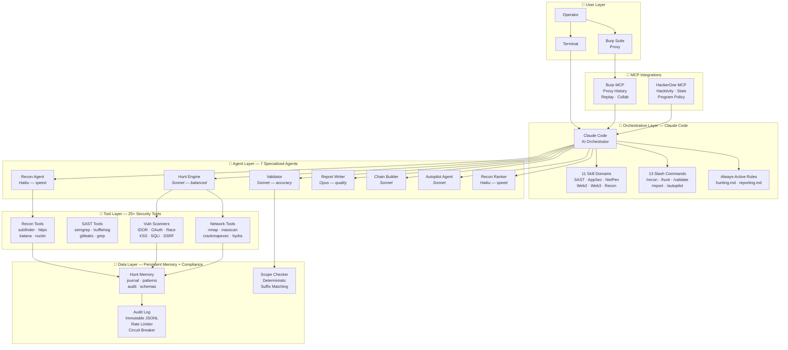
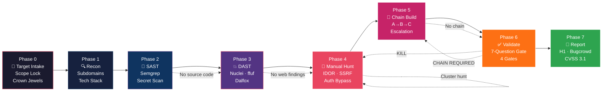
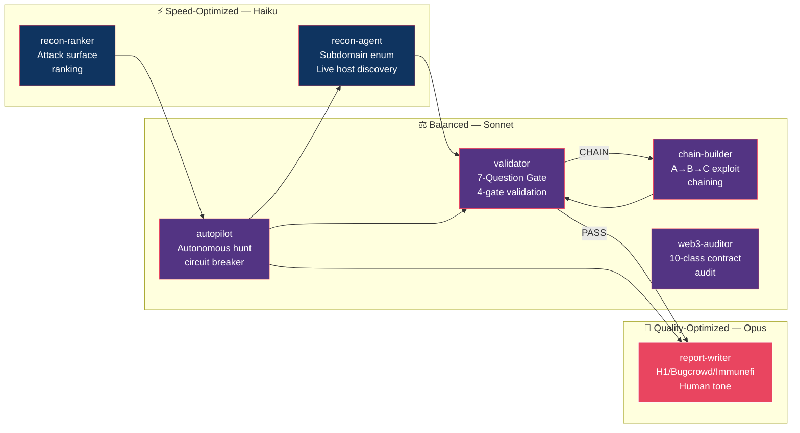
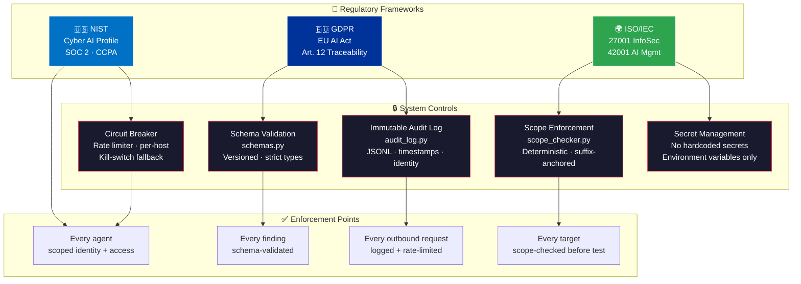

<p align="center">
  
</p>

<div align="center">


# Sentinel AI Offensive

### AI-Powered Offensive Security Platform — Bug Bounty · VAPT · SAST · Network Pentesting

*An autonomous agent harness that orchestrates reconnaissance, static analysis, dynamic testing, exploitation, validation, and reporting — with persistent memory and regulatory compliance built in.*

<sub>by <a href="https://github.com/mlvpatel">Malav Patel</a></sub>

<br>

[](LICENSE)
[](https://python.org)
[](tests/)
[](https://github.com/mlvpatel/sentinel-ai-offensive/actions/workflows/ci.yml)
[](https://claude.ai/claude-code)
[](COMPLIANCE.md)
[](COMPLIANCE.md)
[](COMPLIANCE.md)

<br>

<a href="#-quick-start">Quick Start</a>&nbsp;&nbsp;|&nbsp;&nbsp;<a href="#-system-architecture">Architecture</a>&nbsp;&nbsp;|&nbsp;&nbsp;<a href="#-commands">Commands</a>&nbsp;&nbsp;|&nbsp;&nbsp;<a href="#-compliance--regulatory-alignment">Compliance</a>&nbsp;&nbsp;|&nbsp;&nbsp;<a href="#-installation">Install</a>

<br>

```
  13 commands  ·  7 AI agents  ·  11 skill domains  ·  v1.0.0
  20 web2 vuln classes  ·  10 web3 bug classes  ·  Full network pentest
  SAST pipeline  ·  Burp MCP  ·  HackerOne MCP  ·  Autonomous Mode
```

</div>

<br>

---

<br>

## The Problem

Most offensive security toolkits give you a bag of scripts. You still have to:
- Figure out **what** to test and **in what order**
- Waste hours on **false positives** that get rejected
- Write **reports from scratch** every time
- **Forget** what worked on previous targets
- **Context-switch** between 15 different terminal windows
- Manually ensure **compliance** with NIST, GDPR, and ISO frameworks

<br>

## The Solution

Sentinel AI Offensive is an **agent harness** — not just scripts. It reasons about what to test, validates findings before you waste time writing them up, remembers what worked across targets, enforces regulatory compliance at every stage, and generates reports that actually get paid.

<br>

<div align="center">

| Before | After |
|:---|:---|
| Run scripts manually, hope for the best | AI orchestrates 25+ tools in the right order |
| Write reports from scratch (45 min each) | Report-writer agent generates submission-ready reports in 60s |
| Forget what worked last month | Persistent memory — patterns from target A inform target B |
| Can't see live traffic from Claude | Burp MCP integration — Claude reads your proxy history |
| Hunt one endpoint at a time | `/autopilot` runs full hunt loops with safety checkpoints |
| No compliance audit trail | Immutable JSONL audit log, rate limiting, circuit breakers |

</div>

<br>

---

<br>

## 🔭 System Architecture



<br>

---

<br>

## ⚡ Pipeline Workflow



<br>

### Decision Gates

Each phase has an exit gate that determines the next action:

| Phase Exit | Condition | Next |
|:---|:---|:---|
| Recon → SAST | Source code available | Phase 2 |
| Recon → DAST | No source, live endpoints found | Phase 3 |
| SAST → Hunt | Critical findings need manual confirmation | Phase 4 |
| Hunt → Hunt | Cluster siblings found, rotating endpoint | Phase 4 (loop) |
| Validate → KILL | Any of 7 questions = NO | Discard finding |
| Validate → Chain | Finding needs escalation for impact | Phase 5 |
| Validate → Report | All 7 questions = YES | Phase 7 |

<br>

---

<br>

## 🚀 Quick Start

### Method A — Claude Code Plugin (Recommended)

Use this method to add Sentinel AI Offensive as a skill plugin directly inside Claude Code.

```bash
# 1. Clone the repo
git clone https://github.com/mlvpatel/sentinel-ai-offensive.git
cd sentinel-ai-offensive

# 2. Install skills + commands into Claude Code
chmod +x install.sh && ./install.sh

# 3. Install security tools (subfinder, httpx, nuclei, etc.)
bash install_tools.sh

# 4. Start Claude Code in any project directory
claude
```

Once installed, all 13 slash commands are available in any Claude Code session:

```bash
/recon target.com               # Discover attack surface
/hunt target.com                # Test for vulnerabilities
/validate                       # Check finding before writing
/report                         # Generate submission-ready report
/autopilot target.com --normal  # Full autonomous hunt loop
```

<details>
<summary><b>Where files are installed</b></summary>
<br>

| Path | Contents |
|:---|:---|
| `~/.claude/skills/sentinel-core/` | Master workflow skill (+ 10 other skill domains) |
| `~/.claude/commands/recon.md` | 13 slash commands |

The installer copies `skills/*/SKILL.md` → `~/.claude/skills/` and `commands/*.md` → `~/.claude/commands/`.

</details>

<br>

### Method B — Clone & Use Directly

Use this method to run the Python/shell tools standalone without Claude Code.

```bash
# 1. Clone the repo
git clone https://github.com/mlvpatel/sentinel-ai-offensive.git
cd sentinel-ai-offensive

# 2. Install security tools
bash install_tools.sh

# 3. Run tools directly
python3 tools/hunt.py --target target.com          # Full pipeline
./tools/recon_engine.sh target.com                  # Recon only
python3 tools/intel_engine.py --target target.com   # CVE intel
python3 tools/validate.py                           # Validate a finding
python3 tools/hunt.py --status                      # Show pipeline status
```

<details>
<summary><b>All standalone tools</b></summary>
<br>

| Tool | Usage |
|:---|:---|
| `tools/hunt.py` | `python3 tools/hunt.py --target domain.com` — full orchestrator |
| `tools/recon_engine.sh` | `./tools/recon_engine.sh domain.com` — recon pipeline |
| `tools/hunt.py --recon-only` | Recon only (no vuln scan) |
| `tools/hunt.py --scan-only` | Vuln scan only (requires prior recon) |
| `tools/hunt.py --cve-hunt` | CVE-based hunting |
| `tools/hunt.py --status` | Show current pipeline progress |
| `tools/validate.py` | Interactive 4-gate finding validation |
| `tools/intel_engine.py` | CVE + disclosure intel engine |

</details>

<br>

### Method C — Go Autonomous

After setup with either method, unleash the autonomous hunt loop:

```bash
/autopilot target.com --normal  # Full autonomous hunt loop
/intel target.com               # Fetch CVE + disclosure intel
/resume target.com              # Pick up where you left off
/surface target.com             # AI-ranked attack surface
```


---

<br>

## 🎮 Commands

### Core Workflow

| Command | What It Does |
|:---|:---|
| `/recon target.com` | Full recon — subdomains, live hosts, URLs, nuclei scan |
| `/hunt target.com` | Active testing — scope check, tech detect, test highest-ROI bugs |
| `/validate` | 7-Question Gate + 4 gates — PASS / KILL / DOWNGRADE / CHAIN REQUIRED |
| `/report` | Submission-ready report for H1/Bugcrowd/Intigriti/Immunefi |
| `/chain` | Find B and C from bug A — systematic exploit chaining |
| `/scope <asset>` | Verify asset is in scope before testing |
| `/triage` | Quick 2-minute go/no-go before deep validation |
| `/web3-audit <contract>` | 10-class smart contract checklist + Foundry PoC |

### Autonomous & Memory

| Command | What It Does |
|:---|:---|
| `/autopilot target.com` | Full autonomous hunt loop with safety checkpoints |
| `/surface target.com` | AI-ranked attack surface from recon + memory |
| `/resume target.com` | Resume previous hunt — shows what's untested |
| `/remember` | Save finding or pattern to persistent memory |
| `/intel target.com` | CVEs + disclosures cross-referenced with your hunt history |

<br>

---

<br>

## 🤖 AI Agents



<br>

---

<br>

## 🛡️ Skill Domains

11 specialized skill domains, each a self-contained SKILL.md with checklists, commands, and decision trees:

| Skill | Domain | Lines |
|:---|:---|---:|
| `skills/sentinel-core/` | Master workflow — recon to report, all vuln classes, LLM testing, chains | 1,547 |
| `skills/hunt-mindset/` | Hunting mindset + 5-phase non-linear workflow + tool routing | 352 |
| `skills/apex-pipeline/` | **Unified AppSec pipeline — SAST → DAST → hunt → validate → report** | 562 |
| `skills/code-reaper/` | **Deep SAST — 12 languages, Semgrep, taint analysis, auth audit** | 759 |
| `skills/netbreach/` | **Network pentesting — nmap, AD attacks, privesc, pivoting, wireless** | 1,206 |
| `skills/ghost-recon/` | Subdomain enum, live host discovery, URL crawling, nuclei | 425 |
| `skills/vuln-matrix/` | 20 bug classes with bypass tables (SSRF, XSS, IDOR, AI/LLM) | 832 |
| `skills/payload-forge/` | Payloads, bypass tables, gf patterns, always-rejected list | 838 |
| `skills/chain-guard/` | 10 smart contract bug classes, Foundry PoC template | 550 |
| `skills/strike-report/` | H1/Bugcrowd/Intigriti/Immunefi templates, CVSS 3.1 | 482 |
| `skills/verdict-gate/` | 7-Question Gate, 4 gates, never-submit list | 252 |

<br>

---

<br>

## 🔒 Vulnerability Coverage

<details>
<summary><b>20 Web2 Bug Classes</b> — click to expand</summary>
<br>

| Class | Key Techniques | Typical Payout |
|:---|:---|:---|
| **IDOR** | Object-level, field-level, GraphQL node(), UUID enum, method swap | $500 - $5K |
| **Auth Bypass** | Missing middleware, client-side checks, BFLA | $1K - $10K |
| **XSS** | Reflected, stored, DOM, postMessage, CSP bypass, mXSS | $500 - $5K |
| **SSRF** | Redirect chain, DNS rebinding, cloud metadata, 11 IP bypasses | $1K - $15K |
| **Business Logic** | Workflow bypass, negative quantity, price manipulation | $500 - $10K |
| **Race Conditions** | TOCTOU, coupon reuse, limit overrun, double spend | $500 - $5K |
| **SQLi** | Error-based, blind, time-based, ORM bypass, WAF bypass | $1K - $15K |
| **OAuth/OIDC** | Missing PKCE, state bypass, 11 redirect_uri bypasses | $500 - $5K |
| **File Upload** | Extension bypass, MIME confusion, polyglots, 10 bypasses | $500 - $5K |
| **GraphQL** | Introspection, node() IDOR, batching bypass, mutation auth | $1K - $10K |
| **LLM/AI** | Prompt injection, chatbot IDOR, ASI01-ASI10 framework | $500 - $10K |
| **API Misconfig** | Mass assignment, JWT attacks, prototype pollution, CORS | $500 - $5K |
| **ATO** | Password reset poisoning, token leaks, 9 takeover paths | $1K - $20K |
| **SSTI** | Jinja2, Twig, Freemarker, ERB, Thymeleaf → RCE | $2K - $10K |
| **Subdomain Takeover** | GitHub Pages, S3, Heroku, Netlify, Azure | $200 - $5K |
| **Cloud/Infra** | S3 listing, EC2 metadata, Firebase, K8s, Docker API | $500 - $20K |
| **HTTP Smuggling** | CL.TE, TE.CL, TE.TE, H2.CL request tunneling | $5K - $30K |
| **Cache Poisoning** | Unkeyed headers, parameter cloaking, web cache deception | $1K - $10K |
| **MFA Bypass** | No rate limit, OTP reuse, response manipulation, race | $1K - $10K |
| **SAML/SSO** | XSW, comment injection, signature stripping, XXE | $2K - $20K |

</details>

<details>
<summary><b>10 Web3 Bug Classes</b> — click to expand</summary>
<br>

| Class | Frequency | Typical Payout |
|:---|:---|:---|
| **Accounting Desync** | 28% of Criticals | $50K - $2M |
| **Access Control** | 19% of Criticals | $50K - $2M |
| **Incomplete Code Path** | 17% of Criticals | $50K - $2M |
| **Off-By-One** | 22% of Highs | $10K - $100K |
| **Oracle Manipulation** | 12% of reports | $100K - $2M |
| **ERC4626 Attacks** | Moderate | $50K - $500K |
| **Reentrancy** | Classic | $10K - $500K |
| **Flash Loan** | Moderate | $100K - $2M |
| **Signature Replay** | Moderate | $10K - $200K |
| **Proxy/Upgrade** | Moderate | $50K - $2M |

</details>

<details>
<summary><b>Network Pentesting</b> — click to expand</summary>
<br>

| Phase | Coverage |
|:---|:---|
| **Host Discovery** | nmap, masscan, ARP scan, IPv6, passive OSINT |
| **Service Enumeration** | HTTP, SMB, SSH, DNS, SNMP, SMTP, LDAP, RDP, FTP, MySQL, MSSQL, PostgreSQL, Redis, MongoDB |
| **Vulnerability Assessment** | CVE mapping, default credentials (20+ services), Nessus/OpenVAS |
| **Exploitation** | Metasploit, manual exploits, reverse shells (5 languages) |
| **Privilege Escalation** | Linux (10 checks), Windows (10 checks), GTFOBins, LOLBAS |
| **Active Directory** | AS-REP Roast, Kerberoast, Pass-the-Hash, DCSync, NTLM Relay, Certificate Abuse |
| **Wireless** | WPA2 handshake, PMKID, Evil Twin |

</details>

<details>
<summary><b>SAST Analysis</b> — click to expand</summary>
<br>

| Component | Coverage |
|:---|:---|
| **Languages** | JavaScript/TypeScript, Python, PHP, Go, Ruby, Rust, Java/Kotlin, Solidity (12 total) |
| **Automated Scanning** | Semgrep (3-tier), Trufflehog, Gitleaks, npm audit, pip-audit, govulncheck |
| **Manual Patterns** | 100+ grep patterns across injection sinks by language |
| **Auth Architecture** | The Sibling Rule — routes without auth middleware detection |
| **Taint Analysis** | Source → Sanitizer → Sink tracing methodology |
| **Framework Specific** | Express, Django/Flask, Laravel, Spring Boot, Rails (5 patterns each) |

</details>

<br>

---

<br>

## 🏛️ Compliance & Regulatory Alignment

This platform is designed with security, regulatory compliance, and system resilience as first-class engineering constraints — not afterthoughts.



<br>

### Compliance Matrix

| Framework | Requirement | Implementation |
|:---|:---|:---|
| **🇺🇸 NIST Cyber AI Profile** | AI agents as discrete identities with scoped access | Each of 7 agents has a defined role, model assignment, and tool access scope |
| **🇺🇸 NIST** | Kill-switch / graceful degradation | `/autopilot` circuit breaker stops after N consecutive failures; 3 checkpoint modes (paranoid/normal/yolo) |
| **🇪🇺 GDPR Art. 12** | Immutable event logging with timestamps + identity | `audit_log.py` — append-only JSONL, every request logged with timestamp, agent ID, target |
| **🇪🇺 GDPR** | Right to be Forgotten | No PII stored in hunt memory; findings store only technical data (endpoints, vuln class, PoC) |
| **🇪🇺 EU AI Act** | Transparency markers + HITL oversight | Checkpoint modes require human approval; all agent actions visible in audit log |
| **🌍 ISO 27001** | Principle of Least Privilege | `scope_checker.py` — deterministic domain matching; agents can only access tools in their scope |
| **🌍 ISO 27001** | No hardcoded secrets | All API keys via environment variables (`$CHAOS_API_KEY`, etc.); `credential_store.py` for secure vault |
| **🌍 ISO 27001** | Encryption in transit | All outbound requests via HTTPS; MCP integrations use TLS |
| **🌍 ISO 42001** | AI lifecycle event logging | `hunt_journal.py` + `pattern_db.py` — full lifecycle from recon through report |
| **🌍 ISO 42001** | Validate AI outputs before backend mutations | `validate.py` — 4-gate validation before any report submission; 7-Question Gate |
| **Zero-Trust** | Pinned dependencies, no lifecycle scripts | `install.sh` uses exact versions; `--ignore-scripts` for all npm installs |
| **Zero-Trust** | Explicit approval for new dependencies | Elicitation checkpoint before adding any third-party library |
| **Code Quality** | SOLID, input validation, error handling | `schemas.py` — strict schema validation; structured error responses; no raw traces to client |

<br>

### Elicitation Checkpoints

The platform enforces `🛑 [ELICITATION REQUIRED]` pauses before:

- ⛔ Executing infrastructure changes or deployments
- ⛔ Running database mutations
- ⛔ Adding, removing, or updating third-party dependencies
- ⛔ Pushing code to production branches
- ⛔ Submitting reports to bug bounty platforms (in `/autopilot` mode)

<br>

---

<br>

## 🛠️ Tools & Architecture

<details>
<summary><b>Core Pipeline</b> — <code>tools/</code></summary>
<br>

| Tool | What It Does |
|:---|:---|
| `hunt.py` | Master orchestrator — chains recon, scan, report |
| `recon_engine.sh` | Subdomain enum + DNS + live hosts + URL crawl |
| `learn.py` | CVE + disclosure intel from NVD, GitHub Advisory, HackerOne |
| `intel_engine.py` | Memory-aware intel wrapper (learn.py + HackerOne MCP + memory) |
| `validate.py` | 4-gate validation — scope, impact, dedup, CVSS |
| `report_generator.py` | H1/Bugcrowd/Intigriti report output |
| `scope_checker.py` | Deterministic scope safety with anchored suffix matching |
| `cicd_scanner.sh` | GitHub Actions SAST — wraps [sisakulint](https://github.com/sisaku-security/sisakulint) (52 rules, 81.6% GHSA coverage) |
| `mindmap.py` | Prioritized attack mindmap generator |

</details>

<details>
<summary><b>Vulnerability Scanners</b> — <code>tools/</code></summary>
<br>

| Tool | Target |
|:---|:---|
| `h1_idor_scanner.py` | Object-level and field-level IDOR |
| `h1_mutation_idor.py` | GraphQL mutation IDOR |
| `h1_oauth_tester.py` | OAuth misconfigs (PKCE, state, redirect_uri) |
| `h1_race.py` | Race conditions (TOCTOU, limit overrun) |
| `zero_day_fuzzer.py` | Logic bugs, edge cases, access control |
| `cve_hunter.py` | Tech fingerprinting + known CVE matching |
| `vuln_scanner.sh` | Orchestrates nuclei + dalfox + sqlmap |
| `hai_probe.py` | AI chatbot IDOR, prompt injection |
| `hai_payload_builder.py` | Prompt injection payload generator |

</details>

<details>
<summary><b>MCP Integrations</b> — <code>mcp/</code></summary>
<br>

| Server | Tools Provided |
|:---|:---|
| **Burp Suite** (`burp-mcp-client/`) | Read proxy history, replay requests, Collaborator payloads |
| **HackerOne** (`hackerone-mcp/`) | `search_disclosed_reports`, `get_program_stats`, `get_program_policy` |

</details>

<details>
<summary><b>Hunt Memory System</b> — <code>memory/</code></summary>
<br>

| Module | What It Does |
|:---|:---|
| `hunt_journal.py` | Append-only JSONL hunt log (concurrent-safe via `fcntl.flock`) |
| `pattern_db.py` | Cross-target pattern DB — matches by vuln class + tech stack |
| `audit_log.py` | Every outbound request logged + per-host rate limiter + circuit breaker |
| `schemas.py` | Schema validation for all entry types (versioned) |

</details>

<details>
<summary><b>Full Directory Structure</b> — click to expand</summary>
<br>

```
sentinel-ai-offensive/
├── skills/                     11 skill domains (SKILL.md files)
│   ├── apex-pipeline/        Unified AppSec pipeline
│   ├── code-reaper/          Deep SAST — 12 languages
│   ├── netbreach/        Full network pentesting methodology
│   ├── sentinel-core/             Master workflow
│   ├── hunt-mindset/         Hunting mindset + 5-phase workflow
│   ├── ghost-recon/             Subdomain + URL discovery
│   ├── vuln-matrix/      20 bug classes
│   ├── payload-forge/       Payloads + bypass tables
│   ├── chain-guard/             Smart contract security
│   ├── strike-report/         Report templates
│   └── verdict-gate/      7-Question Gate
├── commands/                   13 slash commands
├── agents/                     7 specialized AI agents
├── tools/                      25+ Python/shell tools
├── memory/                     Persistent hunt memory system
├── mcp/                        MCP server integrations
│   ├── burp-mcp-client/        Burp Suite proxy
│   └── hackerone-mcp/          HackerOne public API
├── tests/                      211 tests
├── rules/                      Always-active hunting + reporting rules
├── hooks/                      Session start/stop hooks
├── docs/                       Payload arsenal + technique guides
├── web3/                       Smart contract skill chain
├── scripts/                    Shell wrappers
└── wordlists/                  5 wordlists
```

</details>

<br>

---

<br>

## 📦 Installation

### Prerequisites

```bash
# macOS
brew install go python3 node jq

# Linux (Debian/Ubuntu)
sudo apt install golang python3 nodejs jq
```

### Install

```bash
git clone https://github.com/mlvpatel/sentinel-ai-offensive.git
cd sentinel-ai-offensive
chmod +x install.sh && ./install.sh     # Install skills + commands into ~/.claude/
bash install_tools.sh                    # Install recon/scan tools + sisakulint
```

### API Keys

<details>
<summary><b>Chaos API</b> (required for recon)</summary>
<br>

1. Sign up at [chaos.projectdiscovery.io](https://chaos.projectdiscovery.io)
2. Export your key:

```bash
export CHAOS_API_KEY="your-key-here"
echo 'export CHAOS_API_KEY="your-key-here"' >> ~/.zshrc
```

</details>

<details>
<summary><b>Optional API keys</b> (better subdomain coverage)</summary>
<br>

Configure in `~/.config/subfinder/config.yaml`:
- [VirusTotal](https://www.virustotal.com) — free
- [SecurityTrails](https://securitytrails.com) — free tier
- [Censys](https://censys.io) — free tier
- [Shodan](https://shodan.io) — paid

</details>

<br>

---

<br>

## The Golden Rules

These are always active. Non-negotiable.

```
 1. READ FULL SCOPE        verify every asset before the first request
 2. NO THEORETICAL BUGS    "Can attacker do this RIGHT NOW?" — if no, stop
 3. KILL WEAK FAST         Gate 0 is 30 seconds, saves hours
 4. NEVER OUT-OF-SCOPE     one request = potential ban
 5. 5-MINUTE RULE          nothing after 5 min = move on
 6. RECON ONLY AUTO        manual testing finds unique bugs
 7. IMPACT-FIRST           "worst thing if auth broken?" drives target selection
 8. SIBLING RULE           9 endpoints have auth? check the 10th
 9. A→B SIGNAL             confirming A means B exists nearby — hunt it
10. VALIDATE FIRST         7-Question Gate (15 min) before report (30 min)
```

<br>

---

<br>

## Contributing

PRs welcome. Best contributions:

- New vulnerability scanners or detection modules
- Payload additions to `skills/payload-forge/SKILL.md`
- New agent definitions for specific platforms
- Real-world methodology improvements (with evidence from paid reports)
- Platform support (YesWeHack, Synack, HackenProof)

```bash
git checkout -b feature/your-contribution
git commit -m "Add: short description"
git push origin feature/your-contribution
```

<br>

---

<br>

<div align="center">

### Connect

[GitHub](https://github.com/mlvpatel)

<br>

---

**For authorized security testing only.** Only test targets within an approved bug bounty scope.<br>
Never test systems without explicit permission. Follow responsible disclosure practices.

---

<br>

MIT License · Copyright (c) 2026 Malav Patel · v1.0.0

**Built for offensive security professionals. Ship bugs, not noise.**

If this helped you find a bug, leave a star. ⭐

</div>
