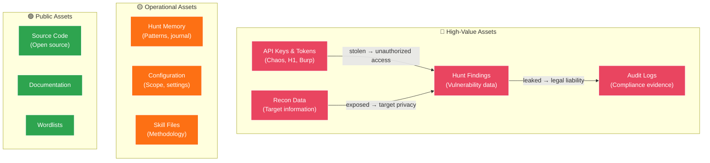
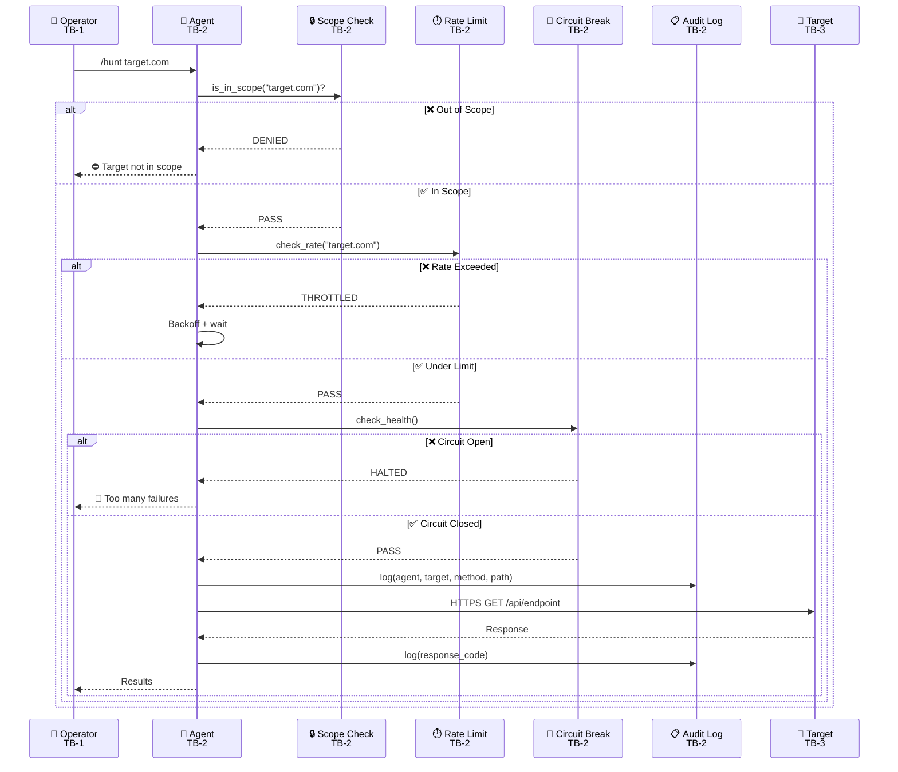

# Security Policy — Sentinel AI Offensive

<div align="center">

**Version 1.0.0** · Malav Patel · [@mlvpatel](https://github.com/mlvpatel)

</div>

---

> **Authorized testing only.** This is tooling for offensive security work you are explicitly authorized to perform (bug bounty scope, signed engagement, or systems you own). It is licensed MIT and ships **no secrets or credentials** — all auth material is read from environment variables at runtime and is never committed to the repository.

---

## Supported Versions

| Version | Supported | Notes |
|:---|:---|:---|
| **1.0.x** | ✅ Active | Current release — full security support |
| < 1.0.0 | ❌ EOL | Legacy versions — no patches |

---

## Reporting a Vulnerability

### If You Discover a Security Issue in This Repository

This is an **offensive security toolkit**. If you find a vulnerability *in the toolkit itself* (not in a target being tested), please report responsibly.

### Contact

| Channel | Details |
|:---|:---|
| **Email** | [malav.patel203@gmail.com](mailto:malav.patel203@gmail.com) |
| **GitHub** | [Open a private security advisory](https://github.com/mlvpatel/sentinel-ai-offensive/security/advisories/new) |
| **Response SLA** | Acknowledgement within **48 hours** · Triage within **5 business days** |

### What to Include

```
Subject: [SECURITY] Brief description of the vulnerability

1. Affected component (file path, module, function)
2. Vulnerability type (e.g., command injection, path traversal, secret exposure)
3. Steps to reproduce
4. Impact assessment (what an attacker could achieve)
5. Suggested fix (if available)
```

### What Happens Next

```
Day 0     You report the vulnerability
Day 0-2   We acknowledge receipt
Day 1-5   We triage and assess severity
Day 5-30  We develop and test a fix
Day 30    We release the fix and credit you (unless you prefer anonymity)
```

### What We Ask

- ⛔ **Do not** open a public issue for security vulnerabilities
- ⛔ **Do not** exploit the vulnerability beyond proof of concept
- ✅ **Do** provide enough detail to reproduce the issue
- ✅ **Do** allow reasonable time for a fix before disclosure

---

## Vulnerability Classification

We use **CVSS 3.1** for severity classification:

| Severity | CVSS Score | Response Time | Example |
|:---|:---|:---|:---|
| 🔴 **Critical** | 9.0 – 10.0 | Fix within **24 hours** | RCE in agent, credential exfiltration |
| 🟠 **High** | 7.0 – 8.9 | Fix within **7 days** | Path traversal writing outside sandbox |
| 🟡 **Medium** | 4.0 – 6.9 | Fix within **30 days** | Information disclosure in error messages |
| 🟢 **Low** | 0.1 – 3.9 | Next release | Cosmetic security headers missing |

---

## Threat Model

### Assets Under Protection



### Trust Boundaries

```mermaid
graph TB
    subgraph TB1["🖥️ TRUST BOUNDARY 1 — User Workstation"]
        direction TB

        subgraph TB2["🧠 TRUST BOUNDARY 2 — Claude Code Runtime"]
            direction TB

            subgraph AGENTS["Agent Layer"]
                A1["⚡ recon-agent\nHaiku"]
                A2["⚖️ validator\nSonnet"]
                A3["⚖️ chain-builder\nSonnet"]
                A4["⚖️ autopilot\nSonnet"]
                A5["💎 report-writer\nOpus"]
                A6["⚖️ web3-auditor\nSonnet"]
                A7["⚡ recon-ranker\nHaiku"]
            end

            subgraph TOOLS["Tool Layer — Python + shell"]
                SCOPE["🔒 scope_checker.py\nSuffix-anchored matching"]
                CRED["🔑 credential_store.py\nMasked output"]
                RECON_T["🔍 recon_engine.sh\n8-phase pipeline"]
                VULN_T["💥 vuln_scanner.sh\n20 vuln classes"]
                CICD_T["🔬 cicd_scanner.sh\nGitHub Actions audit"]
                INTEL_T["📡 intel_engine.py\nCVE + disclosure"]
            end

            subgraph GUARD["🛡️ Security Controls"]
                RATE["⏱️ Rate Limiter\nPer-host throttling"]
                CIRCUIT["🔌 Circuit Breaker\nFailure detection"]
                SAFE["🚫 Safe Method Policy\nBlock PUT/DELETE/PATCH"]
                VALIDATE_T["✅ 4-Gate Validator\n7-Question Gate"]
            end

            subgraph DATA["💾 Data Layer — Append-Only"]
                JOURNAL["📓 Hunt Journal\nJSONL + fcntl.flock"]
                PATTERN["🧩 Pattern DB\nCross-target learning"]
                AUDIT_L["📋 Audit Log\nImmutable event trail"]
                SCHEMAS["📐 Schemas\nVersioned validation"]
            end

            AGENTS -->|"scoped\naccess"| TOOLS
            TOOLS -->|"every request"| GUARD
            GUARD -->|"validated\ndata"| DATA
        end

        subgraph TB3["🌐 TRUST BOUNDARY 3 — External Network"]
            TARGET["🎯 Target Endpoints\nScope-verified before every request"]
            H1_API["🟣 HackerOne API\nHTTPS + rate-limited"]
            BURP_API["🟠 Burp Suite MCP\nlocalhost TLS"]
            NVD["📚 NVD / GitHub Advisory\nRead-only HTTPS"]
        end

        TB2 -->|"scope-checked\naudit-logged\nrate-limited"| TB3
    end

    style TB1 fill:#0d1117,stroke:#30363d,color:#e6edf3
    style TB2 fill:#161b22,stroke:#e94560,color:#e6edf3
    style TB3 fill:#161b22,stroke:#fd7014,color:#e6edf3

    style A1 fill:#0f3460,stroke:#e94560,color:#fff
    style A2 fill:#533483,stroke:#e94560,color:#fff
    style A3 fill:#533483,stroke:#e94560,color:#fff
    style A4 fill:#533483,stroke:#e94560,color:#fff
    style A5 fill:#e94560,stroke:#fff,color:#fff
    style A6 fill:#533483,stroke:#e94560,color:#fff
    style A7 fill:#0f3460,stroke:#e94560,color:#fff

    style SCOPE fill:#1a1a2e,stroke:#2ea44f,color:#fff
    style CRED fill:#1a1a2e,stroke:#2ea44f,color:#fff
    style RECON_T fill:#1a1a2e,stroke:#0f3460,color:#fff
    style VULN_T fill:#1a1a2e,stroke:#0f3460,color:#fff
    style CICD_T fill:#1a1a2e,stroke:#0f3460,color:#fff
    style INTEL_T fill:#1a1a2e,stroke:#0f3460,color:#fff

    style RATE fill:#2d1b69,stroke:#fd7014,color:#fff
    style CIRCUIT fill:#2d1b69,stroke:#fd7014,color:#fff
    style SAFE fill:#2d1b69,stroke:#fd7014,color:#fff
    style VALIDATE_T fill:#2d1b69,stroke:#fd7014,color:#fff

    style JOURNAL fill:#162447,stroke:#1f4068,color:#fff
    style PATTERN fill:#162447,stroke:#1f4068,color:#fff
    style AUDIT_L fill:#162447,stroke:#1f4068,color:#fff
    style SCHEMAS fill:#162447,stroke:#1f4068,color:#fff

    style TARGET fill:#b91c1c,stroke:#fff,color:#fff
    style H1_API fill:#6C3483,stroke:#fff,color:#fff
    style BURP_API fill:#fd7014,stroke:#fff,color:#fff
    style NVD fill:#0f3460,stroke:#fff,color:#fff
```



#### Trust Boundary Summary

| Boundary | Zone | Sensitivity | Key Controls |
|:---|:---|:---|:---|
| **TB-1** | User Workstation | 🟡 Medium | OS-level isolation, file permissions, `.gitignore` |
| **TB-2** | Claude Code Runtime | 🔴 High | Agent scoping, tool access control, schema validation |
| **TB-3** | External Network | 🔴 Critical | Scope checker, rate limiter, circuit breaker, audit log |

#### Data Flow Across Boundaries



### Attack Vectors & Mitigations

| # | Attack Vector | Risk | Mitigation | Implementation |
|:---|:---|:---|:---|:---|
| AV-1 | **Credential leakage** in conversation transcript | 🔴 High | Credential store masks secrets; `.env` in `.gitignore` | `tools/credential_store.py` |
| AV-2 | **Out-of-scope testing** causing legal liability | 🔴 High | Deterministic scope checker gates every target (suffix-anchored matching); `attest.py` proves the whole session stayed in scope | `tools/scope_checker.py`, `tools/attest.py` |
| AV-3 | **Destructive HTTP methods** in autopilot mode | 🔴 High | Safe method policy blocks PUT/DELETE/PATCH without approval | `memory/audit_log.py` → `SafeMethodPolicy` |
| AV-4 | **Runaway autopilot** burning requests / triggering bans | 🟠 High | Circuit breaker + per-host rate limiter | `memory/audit_log.py` → `CircuitBreaker` + `RateLimiter` |
| AV-5 | **Report submission** without human review | 🟡 Med | 4-gate validation + elicitation checkpoints | `tools/validate.py` |
| AV-6 | **Dependency supply chain** compromise | 🟡 Med | Pinned versions; `--ignore-scripts` on npm install | `install.sh`, `install_tools.sh` |
| AV-7 | **Audit log tampering** to hide actions | 🟡 Med | Tamper-evident hash-chained audit log (`prev_hash`/`entry_hash`); `verify_chain()` / `attest.py` detect any edit and exit non-zero | `memory/audit_log.py`, `tools/attest.py` |
| AV-8 | **Sensitive data in hunt memory** | 🟢 Low | Schema validation prevents PII storage; technical data only | `memory/schemas.py` |
| AV-9 | **TLS interception (MITM)** on outbound API calls | 🟠 High | Verifying TLS context backed by `certifi`'s CA bundle; `certifi` is a required dependency (fixes the prior `CERT_NONE` fallback on the HackerOne path) | `mcp/hackerone-mcp/server.py`, `tools/learn.py`, `requirements.txt` |
| AV-10 | **Command injection** via shelled-out subprocess | 🟡 Med | No `shell=True` in the tested core (scope checker, oracle, attest, memory); args passed as lists | `tools/scope_checker.py`, `memory/` |

---

## Secure Development Lifecycle

### Code Contribution Requirements


### Security Review Checklist

Every PR touching security-critical paths must verify:

```
[ ] No hardcoded API keys, tokens, or credentials
[ ] All outbound requests flow through scope_checker.py
[ ] All outbound requests logged via audit_log.py
[ ] All data entries validated via schemas.py
[ ] No subprocess calls with user-controlled input without sanitization
[ ] No eval(), exec(), or dynamic code execution on untrusted input
[ ] Error messages do not leak internal paths or stack traces
[ ] Credential store used for all auth token handling
[ ] Tests cover both happy path and adversarial input
```

### Dependency Management

| Principle | Implementation |
|:---|:---|
| **Minimal dependencies** | Core tools use Python stdlib plus two pinned runtime deps (`requests`, `certifi`); everything else is documented and optional |
| **Pinned versions** | Go binaries installed via `@latest` with version verification |
| **No lifecycle scripts** | `--ignore-scripts` flag on all npm operations |
| **SCA scanning** | `pip-audit`, `npm audit`, `govulncheck` in SAST pipeline |
| **Vendored wordlists** | Shipped in repo — no runtime download from untrusted sources |

---

## Runtime Security Controls

### Defense-in-Depth Stack

```
Layer 7 │ Elicitation Checkpoints      │ Human approves destructive actions
Layer 6 │ 4-Gate Validation             │ Finding quality enforcement
Layer 5 │ Safe Method Policy            │ Block PUT/DELETE/PATCH in autopilot
Layer 4 │ Circuit Breaker               │ Stop after N consecutive failures
Layer 3 │ Per-Host Rate Limiter         │ Prevent target abuse
Layer 2 │ Scope Checker                 │ Deterministic domain verification
Layer 1 │ Audit Log                     │ Hash-chained JSONL event trail
Layer 0 │ Schema Validation             │ Typed, versioned data contracts
```

### Trust Layer — Attestable Controls

These controls are tested and produce machine-checkable evidence, so a triager can trust the engine's behavior rather than take it on faith:

| Control | Property | Implementation |
|:---|:---|:---|
| **Tamper-evident audit log** | Every entry is hash-chained (`prev_hash` → `entry_hash`). Any edit to a past entry breaks the chain; `verify_chain()` reports the first break. | `memory/audit_log.py`, `memory/schemas.py` |
| **Deterministic scope attestation** | `python3 tools/attest.py <audit.jsonl>` verifies the chain, prints the chain head, and **exits non-zero if any request's scope check was not `pass`** — a portable "we never went out of scope" proof. | `tools/attest.py` |
| **Scope gating** | Every target is checked deterministically (suffix-anchored matching) before any request goes out. | `tools/scope_checker.py` |
| **TLS verification enforced** | Outbound HTTPS uses a verifying TLS context backed by `certifi`'s CA bundle; `certifi` is a required dependency. The earlier `CERT_NONE` fallback on the HackerOne path no longer applies in a normal install. | `mcp/hackerone-mcp/server.py`, `tools/learn.py`, `requirements.txt` |
| **No `shell=True` in the tested core** | Subprocess calls in the tested core (scope checker, oracle, attest, `memory/`) pass arguments as lists — no shell string interpolation. | `tools/`, `memory/` |

### Secrets Management

```
✅ DO                                  ❌ DON'T
─────────────────────────────────────────────────────────────
Environment variables ($CHAOS_API_KEY)  Hardcode in source files
.env file (in .gitignore)              Commit to git history
credential_store.py (masked output)    Print tokens in logs
as_headers() for auth                  Interpolate in f-strings
get_masked() for display               Store in conversation transcript
```

### Files That Must Never Be Committed

```
.env                    # API keys and tokens
config.json             # User-specific configuration
findings/               # Vulnerability data (legal sensitivity)
recon/                  # Target reconnaissance data
reports/                # Generated reports
*.burp                  # Burp Suite project files
hunt_memory/            # Persistent hunt data
credentials/            # Any credential material
*.key / *.pem / *.cert  # Cryptographic material
```

---

## Incident Response

### Severity Classification for Toolkit Incidents

| Level | Criteria | Response |
|:---|:---|:---|
| **SEV-1** | Credential exposure in public commit; RCE in agent | Immediate remediation, rotate all affected keys, notify users |
| **SEV-2** | Scope checker bypass; audit log can be tampered | Patch within 24h, advisory published |
| **SEV-3** | Information disclosure in error messages | Fix in next release, document workaround |
| **SEV-4** | Missing security headers in MCP server | Track in backlog |

### If You Accidentally Commit Secrets

```bash
# 1. Immediately rotate the exposed credential
# 2. Remove from git history:
git filter-branch --force --index-filter \
  'git rm --cached --ignore-unmatch PATH_TO_FILE' \
  --prune-empty --tag-name-filter cat -- --all

# 3. Force push (coordinate with team)
git push origin --force --all

# 4. Run secret scanner to verify cleanup
trufflehog git file://. --since-commit HEAD~10
gitleaks detect --source . -v
```

---

## Supply Chain Security

### Third-Party Tool Verification

All security tools installed by `install_tools.sh` are verified:

| Tool | Source | Verification |
|:---|:---|:---|
| Go binaries | `go install` from source | Compiled from source via Go module system |
| sisakulint | GitHub Releases | Binary downloaded with version pinning |
| Python tools | PyPI | `pip-audit` for vulnerability scanning |
| Wordlists | Vendored in repo | No runtime download from external sources |

### SBOM (Software Bill of Materials)

Core is Python stdlib plus two small pinned runtime deps (`requirements.txt`):

```
sentinel-ai-offensive v1.0.0
├── Python 3.8+ (stdlib)
│   ├── json, os, sys, subprocess
│   ├── urllib.request, urllib.error
│   ├── datetime, pathlib, hashlib
│   ├── fcntl (file locking)
│   └── argparse, dataclasses
├── Runtime deps (requirements.txt)
│   ├── requests (HTTP client)
│   └── certifi (TLS certificate verification)
├── External Tools (installed separately)
│   ├── subfinder, httpx, nuclei, katana
│   ├── nmap, masscan, ffuf, dalfox
│   ├── semgrep, trufflehog, gitleaks
│   └── sisakulint (CI/CD scanner)
└── Optional
    └── pytest (development/testing only)
```

---

<div align="center">

**Security is a first-class engineering constraint, not an afterthought.**

For questions about this policy, contact [@mlvpatel](https://github.com/mlvpatel).

</div>
